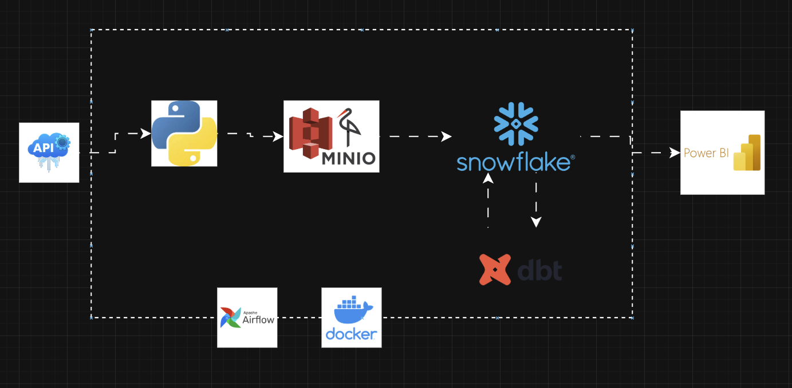

# Tourism Triplens Countries Explorer Data Engineering Project

A data engineering project focused on country-level travel intelligence and destination comparison. This solution extracts country metadata from a public API, stores the raw data, and transforms it into an analytics-ready structure for travel and market analysis.

## Project Overview
This project demonstrates how public country and destination data can be ingested, standardized, and prepared for analytics in a modern data pipeline. The use case sits in the travel, tourism, and market intelligence industry, where organizations need reliable country-level insights for destination planning, regional comparisons, and data-driven travel decisions.

### Data Pipeline Architecture

## Industry Focus
- Travel and tourism
- Destination research and market intelligence
- Country and regional analytics
- Data-driven decision support

## Data
The pipeline works with country metadata and travel-relevant attributes, including:
- country names and official names
- capital city and region/subregion
- continent and landlocked status
- population and timezone
- calling codes and currencies
- government and membership indicators

This data supports comparative country analysis, destination profiling, and travel-related market insight.

## Architecture
The project follows a lakehouse-style workflow:
- Raw: source country data collected from an API and stored in object storage
- Staging: standardized and normalized data in a warehouse-ready structure
- Transformation: dbt models build the curated country dataset for analysis
- Reporting: analytics-ready data in Snowflake for downstream exploration

## Tools and Technologies
- Python
- Apache Airflow for orchestration
- MinIO for object storage
- Snowflake for the warehouse layer
- dbt for transformation and modeling
- Docker for reproducible local setup

## Workflow
1. Extract country metadata from the public REST Countries API
2. Store the raw payload in object storage
3. Load the source data into Snowflake
4. Transform and model the data with dbt
5. Prepare a clean, query-ready dataset for country analysis

## CI / CD
This repository includes automated CI/CD workflows using GitHub Actions (see .github/workflows):
- dbt CI (dbt_ci.yml): runs dbt build/test on pull requests and main to validate models and schema changes.
- Docker Deploy (docker_deploy.yml): builds and optionally publishes a Docker image for deployments; used for reproducible environment delivery.

## What This Project Shows
- End-to-end data pipeline design
- API ingestion and staged data workflows
- Data transformation and warehouse modeling
- Snowflake integration for analytics
- Travel and tourism analytics use cases
- Reproducible ELT orchestration with Airflow and Docker

## Repository Purpose
This repository is designed to highlight practical data engineering capabilities in the travel and tourism analytics space, with a focus on real-world data pipelines, warehouse transformations, and country-level decision support.

